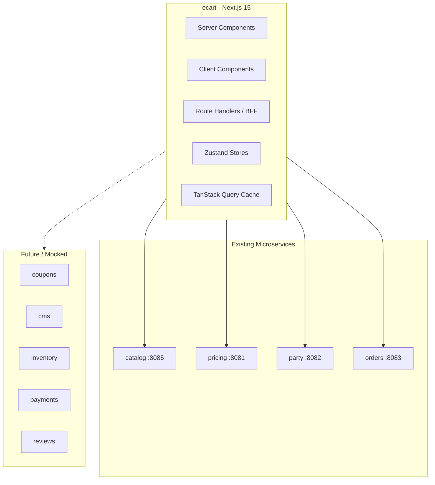
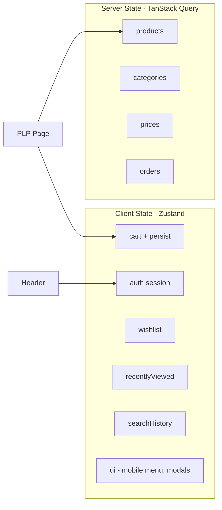
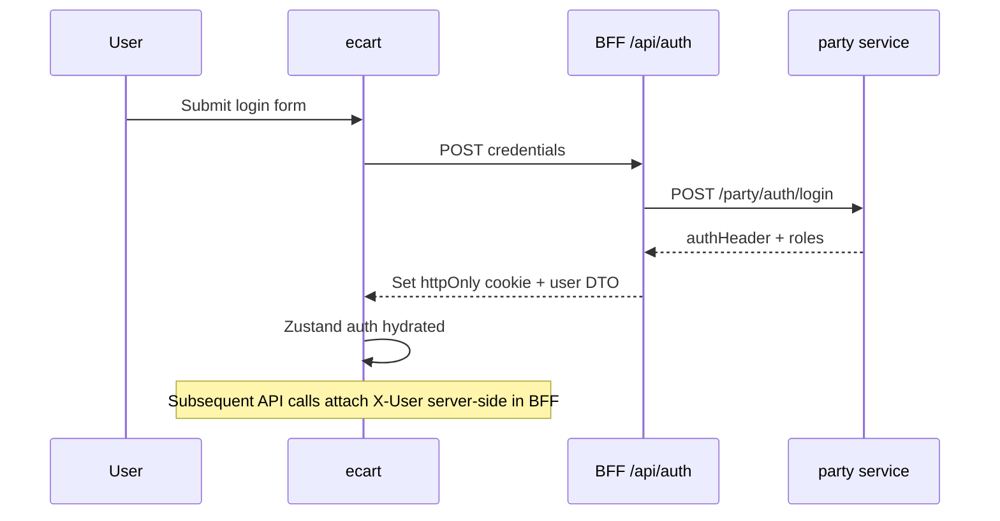
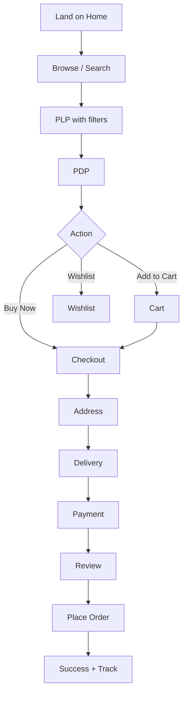

# PlayPro Storefront — Architecture & Implementation Plan

> Customer-facing e-commerce web application (`ecart`)  
> Design inspiration: **Nike.com**, **one8.com** — bold typography, sport-first navigation, immersive imagery.

---

## 1. System Context



### Responsibility boundary

| Layer | Owner | ecart scope |
|-------|-------|-------------|
| Admin panel | `catalog-admin` | **Out of scope** |
| Product/catalog CRUD | catalog service | Read-only consumption |
| Pricing | pricing service | Read-only consumption |
| Customer identity | party service | Auth UI + future customer APIs |
| Order placement | orders service | Checkout + order history |
| Cart, wishlist, CMS, coupons | Not yet built | Client persistence + BFF mocks |

---

## 2. Tech Stack

| Concern | Choice |
|---------|--------|
| Framework | Next.js 15+ App Router, React 19 |
| Language | TypeScript (strict) |
| Styling | Tailwind CSS 4 + CSS variables |
| Components | shadcn/ui (Radix primitives) |
| Server state | TanStack Query v5 |
| Client state | Zustand (cart, auth session, UI, recently viewed) |
| Forms | React Hook Form + Zod |
| Images | `next/image` + catalog public image URLs |
| SEO | `metadata`, JSON-LD, sitemap, robots |

---

## 3. Folder Structure

```
src/
├── app/                          # App Router pages & layouts
│   ├── (shop)/                   # Public shopping routes
│   │   ├── products/
│   │   ├── search/
│   │   ├── cart/
│   │   ├── checkout/
│   │   └── wishlist/
│   ├── (auth)/                   # Login, signup, OTP
│   ├── (account)/                # Protected account area
│   ├── (cms)/                    # Static/dynamic CMS pages
│   ├── api/                      # BFF route handlers
│   ├── layout.tsx
│   ├── page.tsx                  # Home
│   ├── robots.ts
│   └── sitemap.ts
├── components/
│   ├── ui/                       # shadcn primitives
│   ├── layout/                   # Header, Footer, MobileNav
│   ├── product/                  # ProductCard, Gallery, etc.
│   ├── home/                     # Hero, sections
│   └── shared/                   # Skeletons, ErrorBoundary
├── features/                     # Feature modules (domain logic)
│   ├── auth/
│   ├── cart/
│   ├── catalog/
│   ├── checkout/
│   ├── orders/
│   ├── search/
│   └── wishlist/
├── services/                     # API clients (typed)
│   ├── catalog.service.ts
│   ├── pricing.service.ts
│   ├── party.service.ts
│   ├── orders.service.ts
│   └── http.client.ts
├── hooks/                        # useCart, useAuth, useDebounce, etc.
├── store/                        # Zustand slices
├── lib/                          # utils, cn(), query-client
├── types/                        # Shared DTOs & domain types
├── utils/                        # pricing, format, sanitize
├── constants/                    # routes, config, nav
├── providers/                    # QueryProvider, ThemeProvider
├── layouts/                      # ShopLayout, AccountLayout
└── middleware.ts                 # Auth guards, security headers
```

---

## 4. Routing Structure

| Route | Page | Rendering |
|-------|------|-----------|
| `/` | Home | RSC + client carousels |
| `/products` | PLP | RSC shell + client filters/infinite scroll |
| `/products/[slug]` | PDP | RSC product fetch + client gallery/variants |
| `/search` | Search results | Client |
| `/cart` | Cart | Client (Zustand + persist) |
| `/checkout` | Multi-step checkout | Client |
| `/checkout/success` | Order confirmation | RSC |
| `/wishlist` | Wishlist | Client |
| `/login`, `/signup` | Auth | Client forms |
| `/account/*` | Dashboard, orders, addresses | Protected |
| `/pages/[slug]` | CMS (About, Privacy, etc.) | RSC + static fallback |
| `/help`, `/contact` | Support | RSC |

### SEO-friendly URLs

- `/products?category=badminton&brand=nike&sort=price_asc`
- `/products/badminton-racket-pro-500` (slug from `productId` + name)
- Canonical tags on filtered PLP point to base or primary filter set

---

## 5. State Management



| Store | Persistence | Notes |
|-------|-------------|-------|
| `useCartStore` | localStorage + merge on login | Guest + logged-in |
| `useAuthStore` | httpOnly cookie via BFF (target) / sessionStorage (dev) | `X-User` header for APIs |
| `useWishlistStore` | localStorage | Sync to API when available |
| `useRecentlyViewedStore` | localStorage | Max 12 items |
| `useSearchHistoryStore` | localStorage | Max 10 queries |

---

## 6. API Integration Layer

### HTTP client (`services/http.client.ts`)

- Base URLs from env (`NEXT_PUBLIC_*`)
- Request interceptor: attach `X-User` from auth store
- Response interceptor: 401 → redirect login
- Typed errors (`ApiError`)
- Request ID header for tracing

### Service modules

| Service | Endpoints used |
|---------|----------------|
| `catalog.service` | products find/search, categories tree, prod-catalog categories, images |
| `pricing.service` | `GET /pricing/products/{id}/prices` |
| `party.service` | login (dev), person profile (future) |
| `orders.service` | create order, find orders, cancel |

### BFF pattern (`app/api/`)

Next.js Route Handlers aggregate catalog + pricing for PDP/PLP to reduce client waterfalls:

- `GET /api/products` — list with prices
- `GET /api/products/[id]` — detail bundle
- `POST /api/auth/login` — set secure cookie, return user
- `POST /api/orders` — proxy with server-side auth

### API assumptions (until storefront BFF exists)

| Feature | Current backend | ecart strategy |
|---------|-----------------|----------------|
| Public catalog | Admin-gated | BFF uses service credentials OR dev `VIEWER` token |
| Customer auth | Missing | UI + mock OTP; wire to party when ready |
| Cart | Missing | Zustand + localStorage |
| Coupons | Missing | Mock validation in BFF |
| Inventory | Missing | Assume in-stock; show badge from product status |
| CMS | Missing | MDX/static content in `content/cms/` |
| Reviews | Missing | Mock store + UI; API contract prepared |
| Payments | Missing | `PaymentProvider` abstraction (Razorpay/Stripe/PayPal) |

### Homepage catalog sections

| UI section | Catalog mapping |
|------------|-----------------|
| Best sellers | `BEST_SELLER` prod-catalog category type (fallback: `PCCT_MOST_POPULAR`) |
| Trending | `TRENDING_CATALOG` (fallback: `PCCT_WHATS_NEW`) |
| Categories | `GET /catalog/categories/tree?root=CAT-ROOT` |
| Brands | Derived from `brandName` on products |

---

## 7. Authentication Flow



**Supported (UI + architecture):** email/password, OTP placeholder, Google OAuth placeholder, forgot/reset password flows.

**Dev workaround:** `NEXT_PUBLIC_DEV_AUTH_*` for catalog reads until public endpoints ship.

---

## 8. Customer Journey



---

## 9. Payment Abstraction

```typescript
interface PaymentProvider {
  id: 'razorpay' | 'stripe' | 'paypal';
  createIntent(order: OrderSummary): Promise<PaymentIntent>;
  confirmPayment(intentId: string): Promise<PaymentResult>;
  handleWebhook(payload: unknown): Promise<WebhookResult>;
}
```

Webhook handlers live in `app/api/webhooks/[provider]/route.ts` (architecture only in Phase 1).

---

## 10. Performance & SEO

| Technique | Implementation |
|-----------|----------------|
| RSC | Home hero metadata, PLP initial data, CMS pages |
| Image optimization | `next/image`, blur placeholders, responsive sizes |
| Code splitting | `dynamic()` for carousels, checkout, account |
| Caching | `revalidate` on catalog reads (60s); Query staleTime |
| Prefetch | `<Link prefetch>` on product cards |
| Skeletons | PLP grid, PDP gallery, cart |
| Core Web Vitals | LCP: priority hero image; CLS: fixed aspect ratios |

**Structured data:** Product, BreadcrumbList, Organization on relevant pages.

---

## 11. Security

| Threat | Mitigation |
|--------|------------|
| XSS | React escaping, DOMPurify for CMS HTML, CSP headers in middleware |
| CSRF | SameSite cookies, BFF POST with CSRF token for mutations |
| Token storage | httpOnly cookies (production); no tokens in localStorage |
| Input | Zod on all forms; sanitize search query params |
| Rate limiting | Middleware architecture + edge rate limit (documented) |

---

## 12. Analytics Integration Points

```typescript
// lib/analytics.ts
trackEvent('product_view', { productId });
trackEvent('add_to_cart', { productId, quantity, value });
trackEvent('begin_checkout', { cartValue });
trackEvent('purchase', { orderId, value });
```

GTM / GA4 / Meta Pixel loaded via `next/script` with consent banner hook.

---

## 13. Implementation Roadmap

### Phase 1 — Foundation (current)
- [x] Project scaffold, configs, folder structure
- [x] HTTP client + catalog/pricing services
- [x] Providers, Zustand stores
- [x] Shop layout (header/footer, sport nav)
- [x] Home page (hero, best sellers, trending, categories, brands)
- [x] BFF product list endpoint
- [x] ARCHITECTURE.md + README

### Phase 2 — Catalog browsing (current)
- [x] PLP filters (brand, price range, rating, in stock, on sale)
- [x] Sort (price, name, rating, discount, newest)
- [x] URL-synced filters + active chips + clear all
- [x] Infinite scroll (intersection observer + load more)
- [x] Facets API
- [x] PDP image gallery with hover zoom
- [x] Product video placeholder
- [x] Size / color selectors
- [x] Specifications, reviews (mock), FAQs
- [x] Related products + frequently bought together
- [x] Personalized recommendations (recently viewed)
- [x] Enhanced search autocomplete with product previews
- [x] Breadcrumb JSON-LD on PDP

### Phase 3 — Cart & checkout
- Full cart UX, coupons (mock), tax/shipping calc
- Multi-step checkout, guest checkout
- Order creation via orders API

### Phase 4 — Auth & account
- Login/signup/OTP UI
- Account dashboard, addresses, orders list
- Wishlist persistence

### Phase 5 — Reviews, support, CMS
- Review read/write UI (mock API)
- Help center, FAQs, contact, tickets placeholder
- CMS pages, policies

### Phase 6 — Payments & polish
- Payment provider integration
- Notifications center
- Analytics wiring, a11y audit, Lighthouse pass

---

## 14. Environment Variables

See `.env.example` in project root.

---

## 15. Design System (Nike / one8 inspired)

| Token | Value |
|-------|-------|
| Primary | `#111111` (near black) |
| Accent | `#FF6B00` (energetic orange — adjustable) |
| Background | `#FFFFFF` / `#F5F5F5` |
| Typography | Geist Sans (headings bold, uppercase nav) |
| Spacing | Generous whitespace, full-bleed heroes |
| Motion | Subtle hover scale on cards, smooth carousel |

---

*Document version: 1.0 — Phase 1 implementation*
